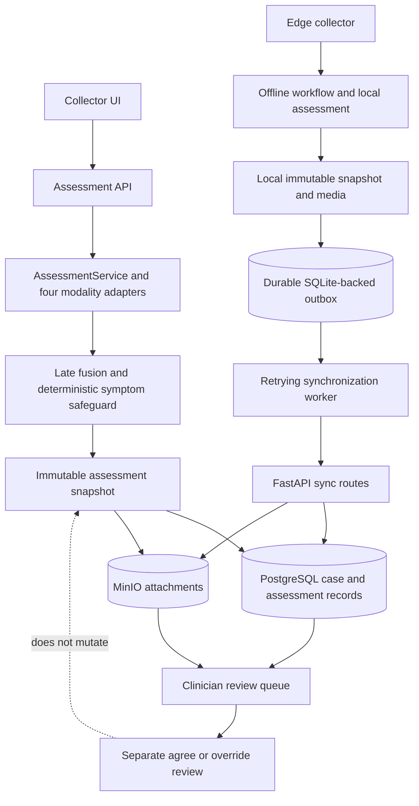

# Case data flow

The edge workflow saves its local assessment snapshot and media before synchronization. The sync routes persist that submitted evidence centrally; they do not rerun the assessment. Clinician review is stored separately and does not modify the snapshot.
