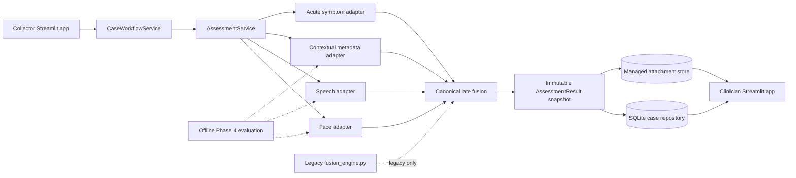

# System architecture

```mermaid
flowchart LR
  Collector[Collector Streamlit app] --> Workflow[CaseWorkflowService]
  Workflow --> Assessment[AssessmentService]
  Assessment --> Face[Face adapter]
  Assessment --> Speech[Speech adapter]
  Assessment --> Metadata[Contextual metadata adapter]
  Assessment --> Symptoms[Acute symptom adapter]
  Face --> Fusion[Canonical late fusion]
  Speech --> Fusion
  Metadata --> Fusion
  Symptoms --> Fusion
  Fusion --> Snapshot[Immutable AssessmentResult snapshot]
  Snapshot --> SQLite[(SQLite case repository)]
  Snapshot --> Attachments[(Managed attachment store)]
  SQLite --> Clinician[Clinician Streamlit app]
  Attachments --> Clinician
  Evaluation[Offline Phase 4 evaluation] -.-> Face
  Evaluation -.-> Speech
  Evaluation -.-> Metadata
  Legacy[Legacy fusion_engine.py] -. legacy only .-> Fusion
```

The legacy fusion path is retained for compatibility and is not imported by the active assessment service.
