# System architecture

```mermaid
flowchart LR
  Collector[Streamlit collector] --> API[FastAPI service]
  API --> Assessment[AssessmentService]
  EdgeUI[Streamlit edge collector] --> Offline[Offline workflow]
  Offline --> LocalAssessment[Local AssessmentService]
  Assessment --> Face[Visual adapter]
  Assessment --> Speech[Speech adapter]
  Assessment --> Metadata[Contextual-risk adapter]
  Assessment --> Symptoms[Deterministic acute-symptom adapter]
  LocalAssessment --> Face
  LocalAssessment --> Speech
  LocalAssessment --> Metadata
  LocalAssessment --> Symptoms
  Face --> Evidence[Common ModalityEvidence contract]
  Speech --> Evidence
  Metadata --> Evidence
  Symptoms --> Evidence
  Evidence --> Fusion[Late fusion, quality and missing-input handling]
  Fusion --> Snapshot[Immutable assessment snapshot]
  Snapshot -->|API assessment path| Postgres[(PostgreSQL case records)]
  Snapshot -->|API attachments| ObjectStore[(Managed attachments in MinIO)]
  Snapshot -->|edge local path| LocalStore[(Durable local SQLite, media and outbox)]
  LocalStore --> Sync[Retrying sync worker]
  Sync --> Ingest[FastAPI sync and case routes]
  Ingest --> Postgres
  Postgres --> Clinician[Streamlit clinician review]
  ObjectStore --> Clinician
  Clinician --> Review[Separate agree or override decision]
```

The standard collector uses the central assessment path. The edge collector can assess and store locally during an API outage; its sync worker later submits the existing local case and snapshot through the API ingestion routes. Clinician review does not change the assessment snapshot.
